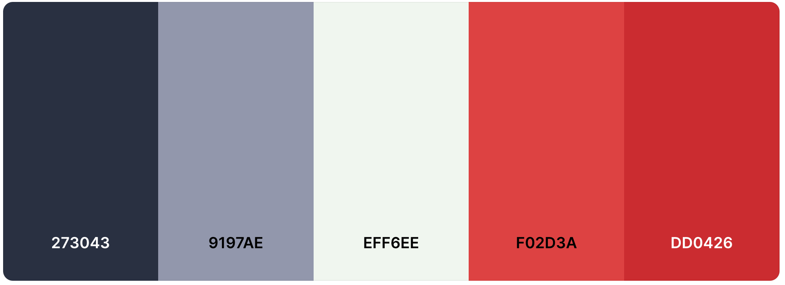
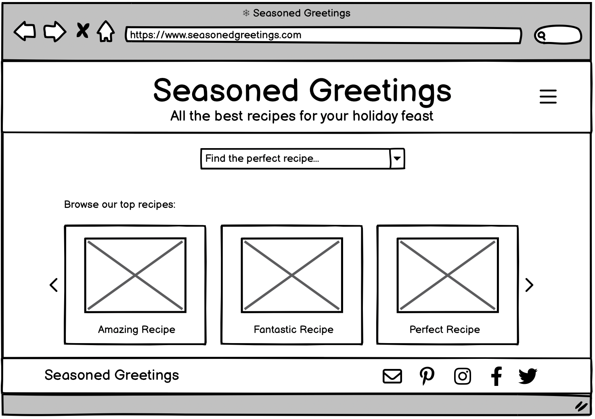
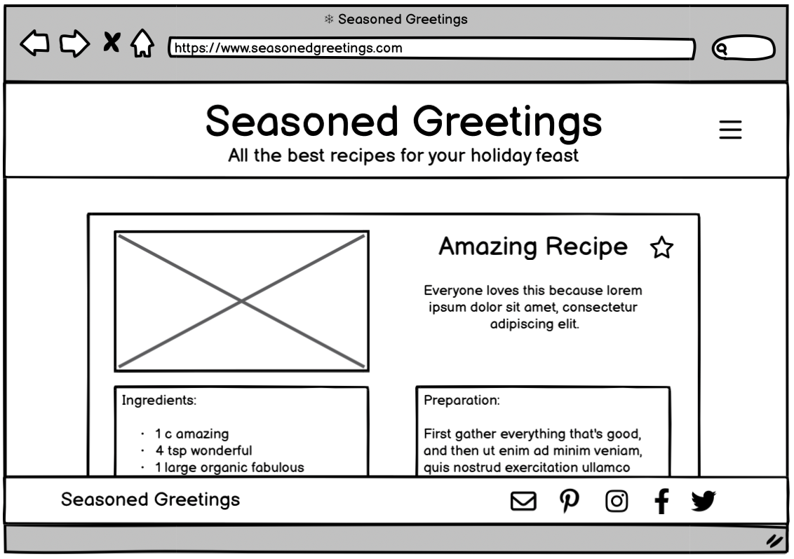

<!-- h3>THIS TEMPLATE IS ONLY TO BE USED ON THE DECEMBER HACKATHON PROJECT</h3>
<h4>Please do not use it for the course project work</h4 -->
 
<h1 align="center"><strong> Seasoned Greetings</strong> 🍒

</h1>

# 🌟 Welcome to Seasoned Greetings Recipe Sharing Hub 🌟
This holiday season, join us in building a platform where people worldwide can share and discover diverse recipes. With a focus on inclusivity and a neutral, festive theme, let's create a global village of culinary delights. Happy sharing and happy holidays!

## Deployment
<!-- #### _(please note, your team must also include the deployed links in the usual submission in Hackapp)_
The project is deployed and can be accessed at [http://your-deployed-link.com](http://your-deployed-link.com). -->
Experience Seasoned Greetings live [here](https://mbutler1991.github.io/seasonedgreetings/).

## Deployment and Local Development
The project is deployed and can be accessed on this [hyperlink.](http://your-deployed-link.com)

## ⚡ Highlights <!-- was Criteria  -->
In this section, we will briefly discuss how our team addressed the applicable criteria:

### 🎨 Creative Design for Enhanced User Experience
#### Color Scheme
- Vibrant color palette from [Coolers](https://coolors.co/).

#### Typography
- Eye-catching 'Sacramento' font for a warm, stylish feel.

<!-- or 
Font Choice: 'Sacramento' font from [Google Fonts](https://fonts.google.com/specimen/Sacramento?query=sacra) was chosen to create an impact on the overall readability and style of the text. 'Great Vibes' and 'Raleway' were also selected for styling. 'Sans-serif' was selected as a backup font.

Font Size: A font size that is comfortable to read was used. Headings and subheadings may have larger font sizes to distinguish them from body text.

Formatting: Options such as bold, italics, and code blocks to highlight important information or code snippets were used. 

Line Spacing: Proper line spacing to enhance readability is used. 

Hierarchy: Appropriate use of headings and subheadings create a clear hierarchy in the site. This helps readers quickly identify different sections and understand the structure of the content.

Consistency: A consistent style is maintained throughout the site lending itself to a professional and polished appearance.

 -->

#### Wireframes

<h4 align="center"><strong> The Landing Page</strong> 🍒

-  

<h4 align="center"><strong> The Recipe Page</strong> 🍒

- 

<h4 align="center"><strong> The Thank You Page</strong> 🍒

- 

<h4 align="center"><strong> The Contact Page</strong> 🍒

- 

### 🚀 Beyond the Basics
- Future-proofed for scalability.
- Integrated API for powerful recipe filtering.
- Contact and Thank You pages for user interaction

<!-- Insert images and more punchy features -->

### 📐 Responsive and Accessible
- The website is responsive on mobiles, tablets, laptops, and desktops.
<!-- Insert responsive testing -->

### Project is well planned using Github Projects
- <!-- Need info for Github Projects well planned -->

### Project is 100% Front-end
- <!-- Need info the project is 100% front-end -->

# ABOUT SUBMISSION
## Intro
<!-- Put in one or two paragraphs providing an overview of our project -->

## Goal
The goal section provides a concise summary of the main objective or purpose of the project or software described in this README. It addresses the following aspects:

➡️ Problem Statement
As a user I want to be able to search recipes with a powerful filtering capacity to accomodate my preferences.

➡️ Objective(s)
The main objective is to create a website that allows users to search for holiday recipes.  
<!-- elaborate on functionality of api as features and achievementsonce it is up and running --> 

➡️ Target Audience
- The target audience is the global citizen.  People across the globe can use this website regardless of religion, culture, dietrary constraints, lifestyle choices and ingredient limitations. 
- Consideration was given to present the holiday spirit in a generic, commercial tone to promote inclusivity.

➡️ Benefits

## 💻 Tech Stack
<!-- In the tech section, we provide information about the technology stack, dependencies, and any technical details related to the project. --> 
- HTML
- CSS
- JavaScript
- Bootstrap 
<!-- check which version Bootstrap was used -->

## Media, Frameworks, Libraries & Programs Used

- [Git](https://git-scm.com/) - For version control.

- [GitHub](https://github.com/) - To save and store the files for the website.

- [Google Fonts](https://fonts.google.com/) - To import the fonts used on the website.

- [Font Awesome](https://fontawesome.com/) - For the iconography on the website.

- [Google Dev Tools](https://developer.chrome.com/docs/devtools/) - To troubleshoot and test features, solve issues with responsiveness and styling.

- [Tiny PNG](https://tinypng.com/) To compress images.

- [Favicon.io](https://favicon.io/) To create favicon.

- [Am I Responsive?](http://ami.responsivedesign.is/) To show the website image on a range of devices.

- [Pexels](https://www.pexels.com/) kindly provided a source for images.

- [Coolers](https://coolors.co/) provided a festive palette used on this site.

<!-- only if applicable- [Shields.io](https://shields.io/) To add badges to the README -->
- [ChatGPT](https://chat.openai.com/) was used as a resource.

## Credits
### Code

- [Code Institute Readme Template Tutorial](Code-Institute-Solutions/readme-template).
- [Code Institue Readme from Kera Cudmore](https://github.com/kera-cudmore).

### ## 🙌 Team 
Hats off to Caylin Dewey, Emily Rosenberg, Jonathan Zakrisson, Mark Butler, and Yakiv Brychuk for crafting Seasoned Greetings. Special thanks to Kasia Bogucka for mentorship.

## Acknowledgements
- Code Institute Hackathon Crew: Kasia Bogucka, Kenan Wright, Kera Cudmore, Lane-Sawyer Thompson for hosting this wondeful Hackathon.
- <b>Code Institute </b> Slack community provided solutions and feedback.

## 🌍 Join the Festivities

This isn't just a project; it's an invitation to a global holiday feast. Let's celebrate the season together at [Seasoned Greetings](https://mbutler1991.github.io/seasonedgreetings/)!

------------------------- should we add this in???  --------------------------------------

### How to Deploy 
Github was used to deploy this site.  The steps are as follows:
1. Log into the [Github site.](https://github.com/)
2. Pull up the repository for [Seasoned Greetings.](https://github.com/Mbutler1991/seasonedgreetings)
3. Select the settings link, then the pages link.
4. In the source section choose 'main' from the dropdown menu.  
5. Select the 'root' from the drop menu and 'save'.
6. The URL that is displayed should have your live Github pages site. 

### How to Fork
1. Log into the [Github site](https://github.com/)
2. Pull up the repository for [Seasoned Greetings](https://github.com/Mbutler1991/seasonedgreetings).
3. Use to the fork button on the top right hand corner.

### How to Clone
1. Log into the [Github site](https://github.com/).
2. Click on the burger menu that will open up the repositories you are working on at the bottom.  Select the project you need.
3. Click on the clone button and select from HTTPS, SSH, or GitHub CLI.  Then copy the link shown.
4. Open your code editor terminal and change the current work directory to the location you want to use for the cloned directory.
5. Type in the terminal 'git clone' and paste your link here. 

## Open Source Contributions
If you would like to contribute to the project, please follow these guidelines:
- For futher guidelines please read [How to contribute to Open Source](https://opensource.guide/how-to-contribute/#how-to-submit-a-contribution)
- Fork the repository [seasonedgreetings](https://github.com/Mbutler1991/seasonedgreetings)
- Name the branch with the feature you intend to add. 
- Commit changes and push to branch
- Open a pull request

