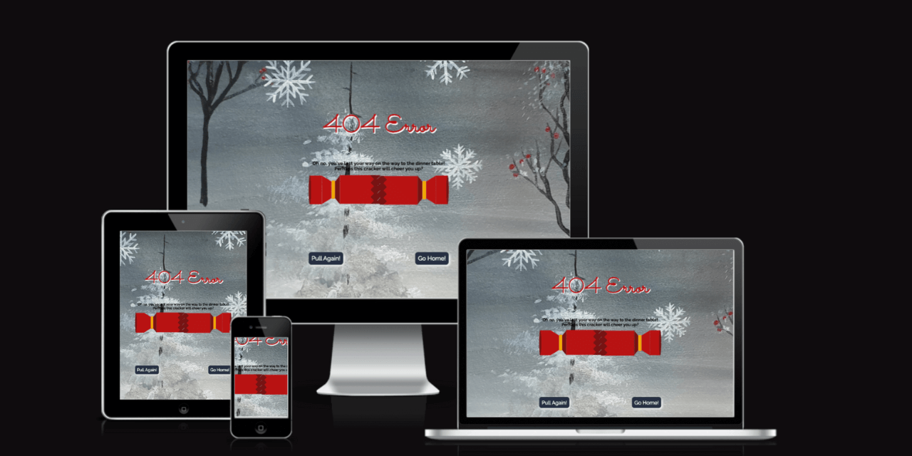

# Seasoned Greetings 🍒

View Seasoned Greetings website [here](https://mbutler1991.github.io/seasonedgreetings/).

## 🌟 Welcome to Seasoned Greetings Recipe Sharing Hub 🌟

Seasoned Greetings - Find a tried and true recipe, or give something new a taste this holiday season!

This holiday season, join us in building a platform where people worldwide can share and discover diverse recipes. With a focus on inclusivity and a neutral, festive theme, let's create a global village of culinary delights. Happy sharing and happy holidays!

This project was created as part of the December 2023 Code Institute Hackathon: Secret Santa, A Holiday Hackathon.

## Project Goals

For the December hackathon, each team participating was given a project theme by random. The Six Seasons team drew the theme recipe sharing site. For this hackathon we were given the brief of creating a project utilising only frontend technology.

➡️ Problem Statement: As a user I want to be able to search recipes with a powerful filtering capacity to accommodate my preferences.

➡️ Objective(s): The main objective is to create a website that allows users to search for holiday recipes.  

➡️ Target Audience: The target audience is the global citizen.  People across the globe can use this website regardless of religion, culture, dietary constraints, lifestyle choices and ingredient limitations. Consideration was given to present the holiday spirit in a generic, commercial tone to promote inclusivity.

While creating this project we were mindful that we future-proof it for scalability. We integrated [TheMealDB](https://www.themealdb.com/) API for powerful recipe filtering and included a contact and thank you pages for user interaction.

## Design

### Color Scheme

We decided on a vibrant color palette for our site, being mindful to choose colours that could represent a number of celebrations over the holiday periods. This consideration steered us away from using the traditional red/green for our site, and we have instead chosen to include colours that reflect the season.

### Typography

Typography was chosen to be fun, but also with accessibility in mind. We chose to use Sacramento for the headings only, due to it being a cursive styled font, and Raleway for the body text on the site. This is a sans-serif font that is very accessible.

### Wireframes

Wireframes were utilised to allow the team to work cohesively with the same vision for the site. Small alterations have been made on the live site where required.

#### Home Page 🍒

-  

#### Recipe Page 🍒

- 

#### Thank You Page 🍒

#### Contact Page 🍒

## Features

Seasoned Greetings is comprised of 7 pages: the home page, favourites page, team page, contact page, thank you page, 404 page and 500 page.

Each page of the site has a favicon, a nav and footer^ and uses the same background image.

### Favicon

The favicon was created using [favicon.io](https://favicon.io).

### Navbar

We opted to go with a toggle navbar to give the site a clean aesthetic. The navbar contains links to the home page, favourites page, contact page and meet the team page. Each link has styling to show that page is active when you are on that page. The site heading also acts as a link back to the home page.

### Footer

The footer contains our copyright, a link to our team page and social media icons that take the user to the social sites in a new browser tab.

*^ The 404 and 500 pages do not have the nav and footer, due to issues with implementing the cracker with the bootstrap CDN included. Instead, a button to return to the home page has been included. This is something that we would like to look at during the next implementation of the site, as we feel that having the same nav and footer throughout the site improves the user experience of the site.*

### Home Page

### Favourites Page

### Meet the Team Page

### Contact Page

### Thank You Page

### 404 Page

### 500 Page

## Future Implementations

* User can add a recipe to the site.
* Review system.
* Search for recipes based on ingredients.
* Enable contact form functionality.

## 💻 Tech Stack

- HTML
- CSS
- JavaScript

## Media, Frameworks, Libraries & Programs Used

- [Git](https://git-scm.com/) - For version control.

- [GitHub](https://github.com/) - To save and store the files for the website. GitHub projects was also utilised to plan and track tickets.

- [TheMealDB API](https://www.themealdb.com/) - API used to enable searching of recipes

- [Bootstrap](https://getbootstrap.com/) - Version 5.3. A CSS framework to develop responsive and mobile first websites.

- [Google Fonts](https://fonts.google.com/) - To import the fonts used on the website.

- [Font Awesome](https://fontawesome.com/) - Version 4.7 Used for some iconography on the website.

- [Google Dev Tools](https://developer.chrome.com/docs/devtools/) - To troubleshoot and test features, solve issues with responsiveness and styling.

- [Tiny PNG](https://tinypng.com/) To compress images.

- [Favicon.io](https://favicon.io/) To create favicon.

- [Am I Responsive?](http://ami.responsivedesign.is/) To show the website image on a range of devices.

- [Pexels](https://www.pexels.com/) kindly provided a source for images.

- [Coolers](https://coolors.co/) provided a festive palette used on this site.

- [Shields.io](https://shields.io/) To add badges to the README

- [ChatGPT](https://chat.openai.com/) - To format and check spelling and grammar for the teams favourite recipes.

## Deployment

### Deployment and Local Development

The project is deployed using GitHub Pages: [Seasoned Greetings](https://mbutler1991.github.io/seasonedgreetings/)

Local development was carried out by the team using a number of different IDE's. A Wiki page [Project Set Up for Collaborators](https://github.com/Mbutler1991/seasonedgreetings/wiki/Project-Set-Up-for-Collaborators) was created by Kera for each team member to utilise to fork, clone and get their workspaces set up to enable collaboration on the project.

Wiki pages were also created for [creating a pull request](https://github.com/Mbutler1991/seasonedgreetings/wiki/Create-a-Pull-Request) and [reviewing & merging a pull request](https://github.com/Mbutler1991/seasonedgreetings/wiki/Review-&-Merge-a-Pull-Request) to give the team a one stop resource to refer to.

These wiki pages were invaluable due to it being 5 members first experience of participating in a hackathon!

## Credits

- A big thank you to the amazing artist [Nikita Ellison](https://www.facebook.com/profile.php?id=100083666804679) for creating a personalised [background image](assets/images/background.jpg) for our site. Nikita was tasked with creating something that would be suitable for a range of holidays. The background was painted using acrylics on a canvas.

### Code

- [Cracker code](https://codepen.io/john_r_muir/pen/RwRObMK)

### 🙌 Team 

Hats off to Caylin Dewey, Emily Rosenberg, Jonathan Zakrisson, Kera Cudmore, Mark Butler and Yakiv Brychuk for crafting Seasoned Greetings. 

Special thanks to Kasia Bogucka, our team facilitator.

## Acknowledgements

A huge thank you to the Code Institute Hackathon Team and the community team for providing these amazing opportunities for us to participate collaboratively with others.

## 🌍 Join the Festivities

This isn't just a project; it's an invitation to a global holiday feast. Let's celebrate the season together at [Seasoned Greetings](https://mbutler1991.github.io/seasonedgreetings/)!
