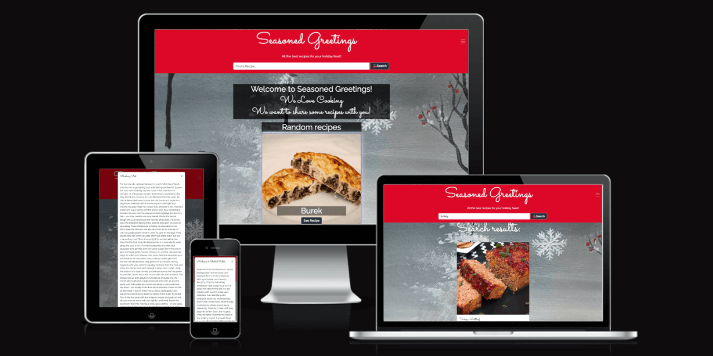

# Seasoned Greetings -  Testing

Visit the deployed site: [Seasoned Greetings](https://mbutler1991.github.io/seasonedgreetings/)

- - -

## CONTENTS

* [AUTOMATED TESTING](#automated-testing)
  * [W3C Validator](#w3c-validator)
  * [JavaScript Validator](#javascript-validator)
  * [Lighthouse](#lighthouse)
  * [WAVE](#wave)
* [MANUAL TESTING](#manual-testing)
  * [Full Testing](#full-testing)

Testing was ongoing throughout the entire build. We utilised Chrome developer tools whilst building to pinpoint and troubleshoot any issues as we went along.

During development we made use of google developer tools to ensure everything was working correctly and to assist with troubleshooting when things were not working as expected.

We utilised the console in the developer tools to work through small sections of JavaScript and ensure that the code was working, and also to troubleshoot where issues were.

We have gone through each page using google chrome developer tools & Firefox inspector tool to ensure that each page is responsive on a variety of different screen sizes and devices.

- - -

## AUTOMATED TESTING

### W3C Validator

[W3C](https://validator.w3.org/) was used to validate the HTML on all pages of the website. It was also used to validate the CSS.

#### HTML

* [Home Page](https://validator.w3.org/nu/?doc=https%3A%2F%2Fmbutler1991.github.io%2Fseasonedgreetings%2Findex.html) - Passed
* [Favourites Page](https://validator.w3.org/nu/?doc=https%3A%2F%2Fmbutler1991.github.io%2Fseasonedgreetings%2Ffavourites.html) - Passed
* [Team Page](https://validator.w3.org/nu/?doc=https%3A%2F%2Fmbutler1991.github.io%2Fseasonedgreetings%2Fteam.html) - 1 warning
* [Contact Page](https://validator.w3.org/nu/?doc=https%3A%2F%2Fmbutler1991.github.io%2Fseasonedgreetings%2Fcontact.html) - Passed
* [Thank You Page](https://validator.w3.org/nu/?doc=https%3A%2F%2Fmbutler1991.github.io%2Fseasonedgreetings%2Fthankyou.html) - Passed
* [404 Page](https://validator.w3.org/nu/?showsource=yes&doc=https%3A%2F%2Fmbutler1991.github.io%2Fseasonedgreetings%2F404.html) - Passed
* [500 Page](https://validator.w3.org/nu/?showsource=yes&doc=https%3A%2F%2Fmbutler1991.github.io%2Fseasonedgreetings%2F500.html) - Passed

#### CSS

* [style.css](documentation/testing/style-css-validation.png)
* [cracker.css](documentation/testing/cracker-css-validation.png)

- - -

### JavaScript Validator

[jshint](https://jshint.com/) was used to validate the JavaScript.

* [script.js](documentation/testing/script-validation.png) - Pass
* [cracker.js](documentation/testing/cracker-validation.png) - Pass
* [api.js](documentation/testing/api-validation.png) - Pass
* [search.js](documentation/testing/search-validation.png) - Pass (One unused variable)

- - -

### Lighthouse

We used Lighthouse within the Chrome Developer Tools to test the performance, accessibility, best practices and SEO of the website.

#### Desktop Results

* [Home Page](documentation/testing/home-dt-lh.png)
* [Favourites Page](documentation/testing/favourites-dt-lh.png)
* [Meet the Team Page](documentation/testing/team-dt-lh.png)
* [Contact Page](documentation/testing/contact-dt-lh.png)
* [Thank You Page](documentation/testing/thankyou-dt-lh.png)
* [404 Page](documentation/testing/404-dt-lh.png)
* [500 Page](documentation/testing/500-dt-lh.png)

#### Mobile Results

* [Home Page](documentation/testing/home-mb-lh.png)
* [Favourites Page](documentation/testing/favourites-mb-lh.png)
* [Meet the Team Page](documentation/testing/team-mb-lh.png)
* [Contact Page](documentation/testing/contact-mb-lh.png)
* [Thank You Page](documentation/testing/thankyou-mb-lh.png)
* [404 Page](documentation/testing/404-mb-lh.png)
* [500 Page](documentation/testing/500-mb-lh.png)

### WAVE

[WAVE](https://wave.webaim.org/) testing was performed on our project to ensure that the site meets minimum accessibility requirements.

- - -

## MANUAL TESTING

### Full Testing

Full testing was performed on the following devices:

* Laptop:
  * Macbook Pro 2021 14 inch screen
* Mobile Devices:
  * iPhone 13 pro.

Each device tested the site using the following browsers:

* Google Chrome
* Safari
* Firefox

Additional testing was taken by friends and family on a variety of devices and screen sizes. 

| Feature | Expected Outcome | Testing Performed | Result | Pass/Fail |
| --- | --- | --- | --- | --- |
| `Navbar` | | | | |
| Site Name | When clicked, the user is taken to the home page | Clicked site name | Taken to the home page | Pass |
| Toggle icon | When clicked the menu will drop down, if the menu is open, clicking will close the menu | Clicked icon when menu closed, and then when open | The menu dropdown displayed, and then closed | Pass |
| Navbar Links | Each link when clicked takes the user to that page | Clicked each link | Taken to the correct page | Pass |
| Search bar| When the user inputs a search term and clicks the search button, results are displayed on the page. If there are no results, the user is given feedback to let them know this | Searched for turkey and searched for ... | Result for turkey meatloaf displayed.| Pass |
||||||
| `Footer` |||||
| Meet the team link | When clicked, the user is redirected to the Meet the Team page | Clicked link | Taken to the meet the team page | Pass |
| Social Icons | When each icon is clicked, the user is taken to their website in a new tab | Clicked icons | Taken to the sites website in a new tab | Pass |
||||||
| `Home Page` |
| Carousel | Users can use the left/right arrows to view items in the carousel | Clicked left/right arrows | Carousel displays next item | Pass |
| Carousel see recipe button | Users can click the see recipe button and the recipe will be displayed in a pop up modal | Clicked button | Modal popped up with the recipe instructions | Pass |
| Close modal button | Users can click this button and the modal will close | clicked close button | Modal closed | Pass |
||||||
| `Meet the Team` |||||
| Team Social Links | Users can click on the LinkedIn or GitHub links on each team members card and they will be taken to the team members LinkedIn or GitHub page in a new tab | Clicked links | New tab with users LinkedIn/GitHub opened | Pass |
||||||
| `Contact` |||||
| Submit completed contact form | User is able to submit contact form if fields are filled out | Submit completed contact form | Taken to thank you page | Pass |
| Submit empty form | If the user tries to submit an empty contact form, they will be prompted by tooltips to complete required fields | Submit form with no fields completed | Tooltip displayed asking user to fill in required fields | Pass |
||||||
||||||
| `404 and 500 pages` |||||
| Go back home button | When the user clicks on the button, they are returned to the home page | Clicked button | Returned to home page | Pass |

## Bugs

### Known Bugs

| Bug No | Issue |
| :---: | :--- |
| 1 | 404 page and 500 page cracker doesn't display correctly when bootstrap CDN link added to the page |
| 2 | 404 page and 500 page are not responsive on mobile |
